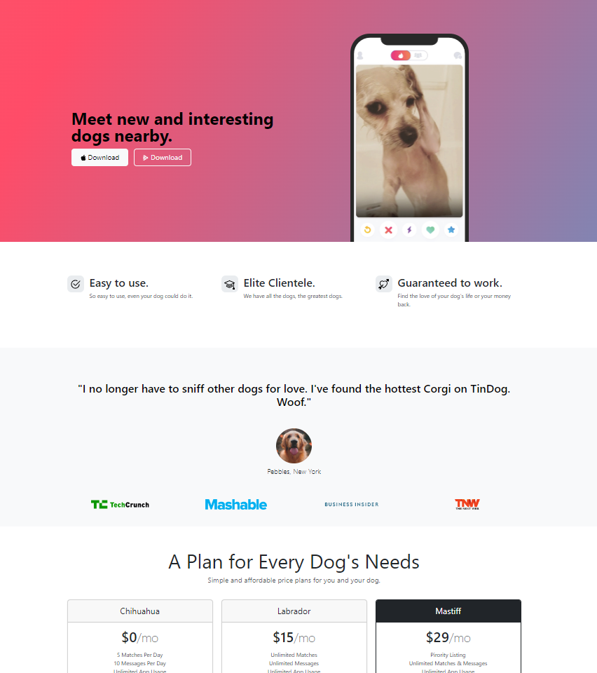

  

## 🖥️ Projeto
Esse é um projeto Web Responsivo de um site para usuários que procuram por cães para adoção.

## 🚀 Tecnologias
Esse projeto foi desenvolvido durante o curso "The Complete 2023 Web Development Bootcamp" com as seguintes tecnologias:

- HTML5
- CSS3
- Bootstrap
- Git e Github